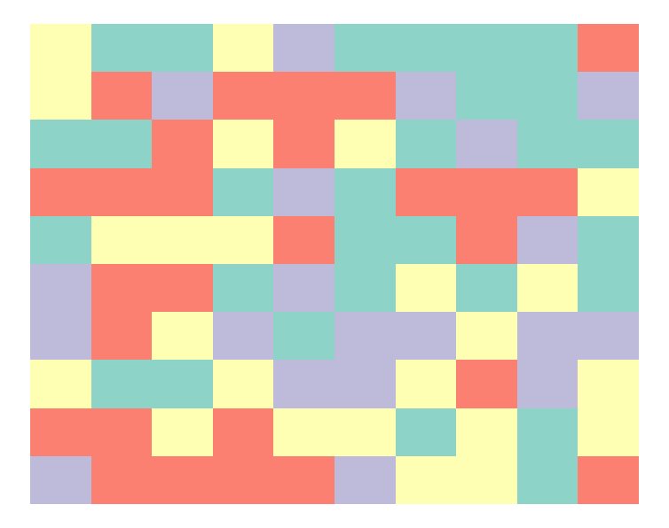

# Coffee and Code

## Code samples to explain/rewrite

### Count the number of transcripts per gene in a GTF annotation

  ```bash
  curl http://ftp.ensembl.org/pub/release-104/gtf/homo_sapiens/Homo_sapiens.GRCh38.104.gtf.gz -o "Homo_sapiens.GRCh38.104.gtf.gz"
  gzip -d "Homo_sapiens.GRCh38.104.gtf.gz"

  grep -Po 'transcript.*gene_id "\K[A-Z0-9]*?(?=")' "Homo_sapiens.GRCh38.104.gtf" | \\
  awk 'BEGIN{print "Gene\ttranscript_count"}{count[$0]++} END{for (gene in count) print gene, count[gene]}' > transcriptcounts.txt
  ```

- Download the latest human gene annotation from [Ensembl](https://www.ensembl.org/Homo_sapiens/Info/Index) in `.gtf`-Format and extract.
- Use grep to print the gene_id for every transcript entry in the file
- To explain the Regex, it might be helpful to see first _what_ we are looking for. A `.gtf` is essentially a tabular format and the third column specifies the entry type of the line.

  ```
  1       havana  transcript      1478026 1497848 .       +       .       gene_id "ENSG00000160072"; gene_version "20"; transcript_id "ENST00000472194";
  ```

- Since we would like to count the number of transcripts per gene, only lines whose third column reads _transcript_ are relevant to us. From those lines, we would like to output the value that follows the _gene_id_label. For this purpose, we match any character until the literal_gene_id_ and retrieve the quoted contents. The interesting part is the `"\K[A-Z0-9]*?(?=")` statement. `\K` resets the starting point of the reported match. Because previously consumed characters are no longer included in the final match, it trims all the part of the line that spans from _transcript_ to _gene_id_. Because Ensembl Gene IDs contain only capital letters and numbers, the character set `[A-Z0-9]` is now matched lazy (expanding as needed) as few times as possible `*?`. The `(?=")` denotes a Positive Lookahead. A Lookahead is a zero-length assertion, because it matches characters, but then gives up the match, returning only the result: match or no match. In this case, we match the quote symbol, but don't make it part of the match. Otherwise our gene names would be returned with a trailing "-character. All of this works, because `-P` parameter instructs `grep` to use Perl regular expressions and `-o` to output only the match.
- Subsequently `awk` is used to count the number of occurrences. After printing a header, an array with the name `count` is instantiated, which uses the full line contents `$0` (the Gene IDs) an index. For every occurrence of the ID, the value is incremented by 1. After the whole file has been seen, the contents of the array are printed: Indexes and values.  

### Reverse complement a DNA sequence in R

  ```R
  revcomp_dna <- function(dna) {
    chartr("ATGC", "TACG",
          sapply(lapply(strsplit(dna, NULL), rev),
                  paste, collapse = ""))
  }

  revcomp_dna(c("TTTTTACGTGTGACCAGAA","CCCCAGCATGCGCGCGATA"))
  ```

- Obtaining the complement of a DNA sequence is very straightforward in R, because the `chartr()` function is the exact equivalent to the `tr` function in the terminal that can, among other things, switch character sets: ` echo "ABCDEFCBA" | tr "ABC" "XYZ" `. Hence, A is replaced by T respectively X and so forth.
- Reversing the DNA sequence itself however is a bit more complicated, because the built-in `rev()` function in R is meant to reverse the order of elements inside a vector, but not the characters inside a string. This is illustrated in this example:

  ```R
  # character vector with one element and nchar 3
  rev(c("ABC"))
  [1] "ABC"

  # character vector with three elements of nchar 1 each
  rev(c("A","B","C"))
  [1] "C" "B" "A"
  ```

  So in order to reverse the sequence of the DNA, we must split the string into a character vector with a separate element for every single letter. This vector can then be reversed and the separate letters are then pasted together again into a single string. The sapply/lapply statements ensure that the function is also vectored and accepts multiple DNA sequences at once to process.  

## Task to solve

The `generate_tiles()` function can be used to create a 2D array composed of colored tiles:

  ```R

library("RColorBrewer")

generate_tiles <-
  function(rows = 2,
          cols = 2,
          colors = 2,
          prob = NULL,
          palette = "Dark1") {
    library("RColorBrewer")
    if (colors <= 9 {
      colorlevels <- brewer.pal(colors, palette)
    } else {
      colorlevels <- colorRampPalette(brewer.pal(9, palette))(colors)
    }

    count <- rows * cols
    
    data.frame(
      "id" = paste("panel", c(1:count)),
      expand.grid(x = c(1:cols), y = c(1:rows)),
      "color" = sample(colorlevels, count, replace = TRUE, prob =
                        prob)
    )
  }

```

*Task*: The code below generates a 10 x 10 array of tiles in 4 discrete colors. Find the patch or patches that are composed of the largest number of directly adjacent (rows or columns but not corners) tiles of the same color:

```R
colorarray <- generate_tiles(rows=10,cols=10,colors=4,palette="Set3")

library("ggplot2")
ggplot(aes(x=x,y=y),data=colorarray) + geom_tile(fill=colorarray$color) + theme_void()
  ```


